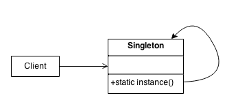
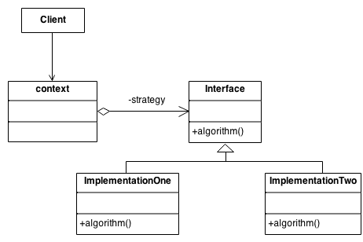
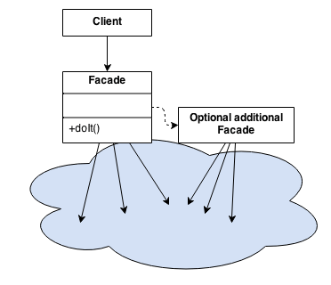

# Design Patterns

This repository contains examples and explanations for three common design patterns: Singleton, Strategy, and Facade.

## Singleton

The Singleton pattern ensures a class has only one instance and provides a global point of access to it.

- **Intent**: To control object creation, limiting the number of objects to one.
- **Use Case**: When only one instance of a class is needed to coordinate actions across a system.

### [Structure](https://sourcemaking.com/design_patterns/singleton)

#### [Example about the Singleton Pattern](./src/main/java/one/digitalinnovation/gof/singleton)

## Summary: What did I learn about the Singleton Pattern? (doing)

### Application (When is it truly a necessity?) (doing)
Practical implementation in a real-world product or project that will evolve into a market-ready solution for the company.

## Strategy

The Strategy pattern defines a family of algorithms, encapsulates each one, and makes them interchangeable.

- **Intent**: To define a family of algorithms, encapsulate each one, and make them interchangeable.
- **Use Case**: When you want to define a class that will have one behavior that is similar to other behaviours in a list.

### [Structure](https://sourcemaking.com/design_patterns/strategy)

#### [Example about the Strategy Pattern](./src/main/java/one/digitalinnovation/gof/strategy)

## Summary: What did I learn about the Strategy Pattern? (doing)

### Application (When is it truly a necessity?) (doing)
Practical implementation in a real-world product or project that will evolve into a market-ready solution for the company.

## Facade

The Facade pattern provides a simplified interface to a complex subsystem.

- **Intent**: To provide a unified interface to a set of interfaces in a subsystem.
- **Use Case**: When you want to provide a simple interface to a complex subsystem.

### [Structure](https://sourcemaking.com/design_patterns/facade)

#### [Example about the Facade Pattern](./src/main/java/one/digitalinnovation/gof/facade)

## Summary: What did I learn about the Facade Pattern? (doing)

### Application (When is it truly a necessity?) (doing)
Practical implementation in a real-world product or project that will evolve into a market-ready solution for the company.
